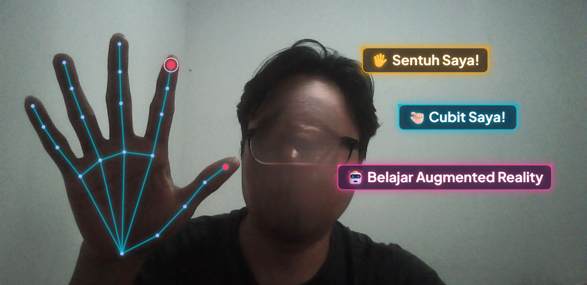

# 🖐️ AR Hand Interactive Touch Color Changer

Aplikasi web interaktif Augmented Reality (AR) berbasis AI yang mendeteksi pergerakan tangan dan jari secara real-time untuk mengubah warna dan memanipulasi teks virtual mengambang (hologram).

---

## 📸 Preview / Screenshot



---

## ✨ Fitur Utama
- **Real-Time Hand Tracking:** Menggunakan Google MediaPipe Hands langsung di browser via WebGL & Canvas.
- **Interaksi Sentuh (Touch Interaction):** Sentuh kotak teks virtual dengan jari telunjuk untuk mengubah warnanya secara dinamis.
- **Pinch to Drag:** Gerakan mencubit (jempol + telunjuk) untuk memindahkan letak teks di layar.
- **Kustomisasi Teks:** Menambahkan teks atau emoji kustom secara langsung ke layar AR.
- **Snapshot Foto AR:** Mengambil gambar layar AR dan menyimpannya secara lokal.
- **Audio Feedback:** Efek suara synth saat objek disentuh menggunakan Web Audio API.

---

## 🛠️ Prasyarat & Instalasi

1. **Clone repositori ini:**
   ```bash
   git clone https://github.com/kang-cakra/ar_hand_color_change.git
   cd ar_hand_color_change
   ```

2. **Buat virtual environment (opsional tapi disarankan):**
   ```bash
   python -m venv venv
   # Windows:
   venv\Scripts\activate
   # Linux / macOS:
   source venv/bin/activate
   ```

3. **Install dependensi:**
   ```bash
   pip install -r requirements.txt
   ```

---

## 🚀 Menjalankan Aplikasi

Jalankan server Flask:
```bash
python app.py
```

Buka browser dan akses:
```
http://127.0.0.1:5000
```

> **Catatan:** Izinkan akses webcam pada peramban/browser saat diminta.

---

## 📁 Struktur Direktori

```
ar_hand_color_change/
├── static/
│   ├── css/
│   │   └── style.css          # Styling UI & Glassmorphism
│   ├── js/
│   │   └── ar_hand.js         # MediaPipe tracking & AR Canvas logic
│   └── snapshots/             # Penyimpanan lokal hasil tangkapan AR
├── templates/
│   └── index.html             # Antarmuka utama aplikasi
├── app.py                     # Backend server Flask
├── image.png                  # Screenshot demo aplikasi
├── pyrightconfig.json         # Konfigurasi linter
├── requirements.txt           # Dependensi Python
└── README.md
```

---

## 🔒 Keamanan & Privasi
- Aplikasi ini memproses deteksi tangan secara **lokal di sisi klien (browser pengguna)** menggunakan WebGL & WebAssembly.
- Tidak ada data video, stream kamera, atau data biometrik yang dikirimkan ke server eksternal.
